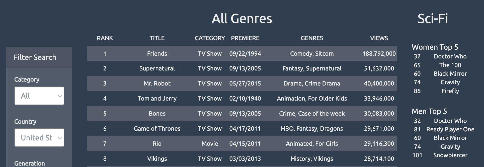
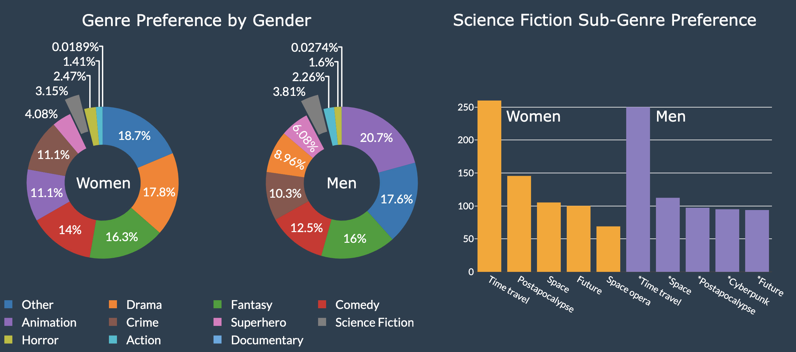

# Science Fiction Streaming Dashboard

## Description 

A suplimentary dashboard I created for a pitch to Netflix demonstrating the viablility of an animated space-based science fiction show geared toward girls.

## Table of Contents
* [Run](#Results)
* [Tools](#Tools)
* [Data](#Data)
* [Graphs](#Graphs)
* [Contact](#Contact)

## Run

This app is hosted on Heroku:

[Science Fiction Strreaming App](https://scifi-stream.herokuapp.com/)

## Tools

PostgreSQL, Python, Flask, Pandas, Splinter, JavaScript, D3, Bootstrap, Jupyter Notebook, HTML5, CSS, SQLite, SQLAlchemy

## Data

I scraped the data from [FlixPatrol](https://www.flixpatrol.com) using Splinter and BeautifulSoup in Python, then inserted results into a SQL database.

The Flask App queries the SQL database, and the data is further processed in JavaScript.

## Graphs

In exploring science fiction streaming prefernce by gender, I found no marked difference between men and women in the youngest demographic.

## Contact

Feel free to contact me with examples or any questions via the information below:

GitHub: [@julia-claira](https://api.github.com/users/julia-claira)

Email: julia-claira@gmail.com
